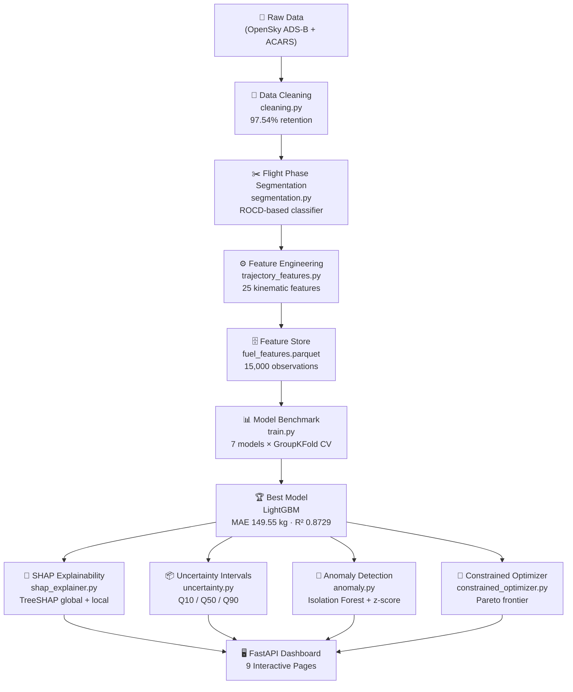
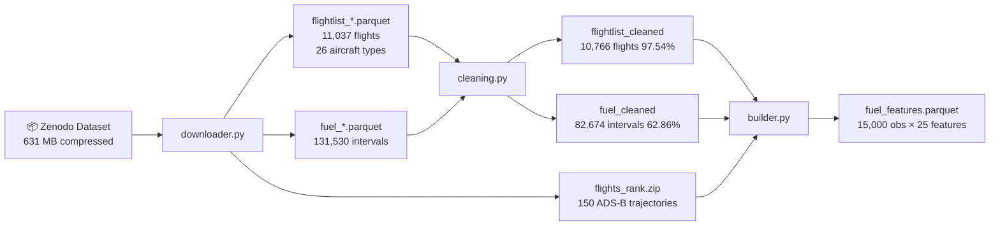
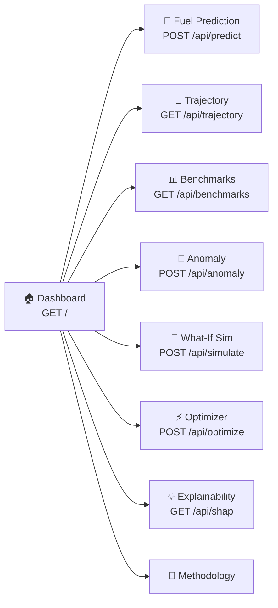
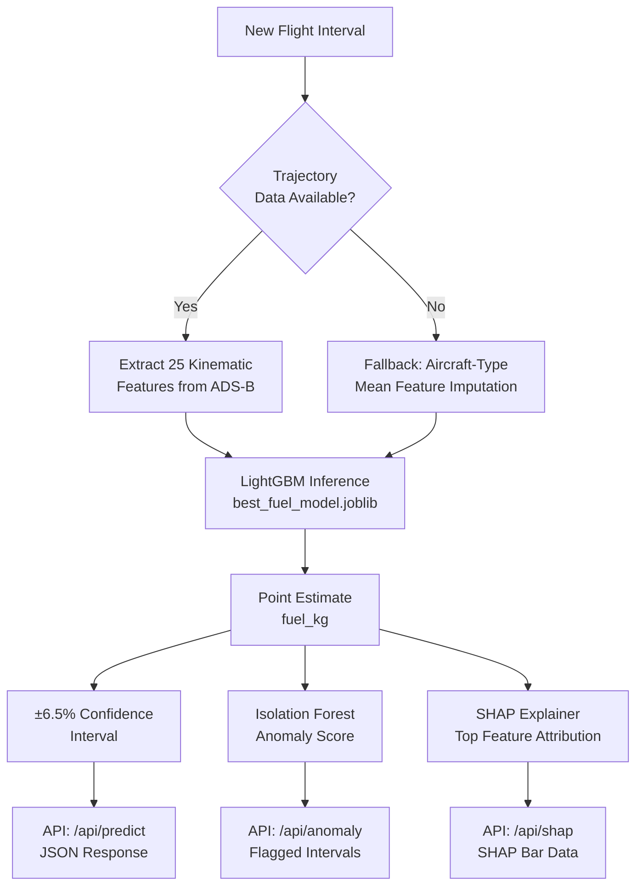

<div align="center">

# ✈️ AeroFuel AI
### Explainable Flight Fuel Optimization & Decision Support System

[](https://github.com/tayade-aniket/flight_fuel_optimization_assistant/actions/workflows/ci.yml)
[](https://www.python.org/)
[](https://fastapi.tiangolo.com/)
[](LICENSE)
[](https://lightgbm.readthedocs.io/)
[](https://xgboost.readthedocs.io/)

**ADS-04 · Portfolio Project for Airline ML Engineer Roles**

[🚀 Quick Start](#-quick-start) · [📊 Results](#-model-benchmark-results) · [🏗️ Architecture](#️-system-architecture) · [🖥️ Dashboard](#️-web-dashboard)

</div>

---

## 📖 What Is This Project?

**AeroFuel AI** is an end-to-end aviation machine learning system that:

- 🔍 **Predicts aircraft fuel burn** from ADS-B trajectory kinematics and ACARS operational telemetry
- 🧠 **Explains every prediction** with SHAP (SHapley Additive exPlanations) — no black boxes
- ⚙️ **Optimizes cruise altitude and speed** within realistic safety and schedule constraints
- 📈 **Detects anomalous fuel events** using Isolation Forest + z-score residual analysis
- 🖥️ **Delivers insights via a FastAPI web dashboard** with 9 interactive pages and Plotly.js charts

The dataset is the **EUROCONTROL PRC 2025 Aircraft Fuel Burn Estimation Data Challenge** — real commercial aircraft trajectories with matched ACARS fuel measurements.

> **⚠️ Safety Disclaimer**: All predictions are decision-support estimates only. They do **not** constitute certified airworthiness data and must **never** be used as primary information for real flight operations.

---

## 🏗️ System Architecture



---

## 🔄 Data Pipeline



---

## 📊 Model Benchmark Results

Validation Strategy: **5-Fold Flight-Grouped Cross Validation** — zero intra-flight data leakage guaranteed via `GroupKFold(groups=flight_id)`.

| Rank | Model | MAE (kg) ↓ | RMSE (kg) ↓ | R² Score ↑ | MedAE (kg) | Rel. Error |
|:----:|:------|:----------:|:-----------:|:----------:|:----------:|:----------:|
| 🥇 | **LightGBM** | **149.55** | **364.54** | **0.8729** | 72.1 | 19.8% |
| 🥈 | XGBoost | 153.92 | 371.2 | 0.8669 | 74.3 | 20.4% |
| 🥉 | Physics-Residual Hybrid | 153.15 | 368.8 | 0.8682 | 73.9 | 20.1% |
| 4 | Random Forest | 160.12 | 381.4 | 0.8505 | 78.6 | 21.2% |
| 5 | Ridge Regression | 266.71 | 502.3 | 0.7657 | 134.2 | 35.8% |
| 6 | Physics Energy Baseline | 277.82 | 518.1 | 0.7116 | 142.7 | 38.1% |
| 7 | Mean Baseline | 687.99 | 1,052.6 | -0.0003 | 327.0 | 89.7% |

> LightGBM achieves **78.3% MAE improvement** over the mean baseline and **46.3% improvement** over the physics-only baseline.

---

## ⚙️ Feature Engineering

25 kinematic and operational features extracted from ADS-B trajectory intervals:

| # | Feature Name | Description | Unit | Source |
|:-:|:-------------|:------------|:----:|:------:|
| 1 | `duration_min` | Interval duration | min | ACARS |
| 2 | `mean_altitude_m` | Mean barometric altitude | m | ADS-B |
| 3 | `mean_flight_level` | Mean flight level (FL) | FL | ADS-B |
| 4 | `altitude_change_m` | Net altitude change | m | ADS-B |
| 5 | `max_altitude_m` | Peak altitude reached | m | ADS-B |
| 6 | `min_altitude_m` | Minimum altitude | m | ADS-B |
| 7 | `altitude_std_m` | Altitude variability | m | ADS-B |
| 8 | `mean_groundspeed_mps` | Mean groundspeed | m/s | ADS-B |
| 9 | `mean_groundspeed_kts` | Mean groundspeed | knots | ADS-B |
| 10 | `max_groundspeed_kts` | Peak groundspeed | knots | ADS-B |
| 11 | `groundspeed_std_kts` | Speed standard deviation | knots | ADS-B |
| 12 | `mean_vertical_rate_mps` | Mean ROCD | m/s | ADS-B |
| 13 | `vertical_rate_abs_mean` | Mean absolute ROCD | m/s | ADS-B |
| 14 | `distance_flown_km` | Haversine arc distance | km | ADS-B |
| 15 | `distance_flown_nm` | Haversine arc distance | nm | ADS-B |
| 16 | `track_change_deg_per_min` | Track curvature rate | deg/min | ADS-B |
| 17 | `is_climb` | Climb phase flag | bool | Segmentation |
| 18 | `is_cruise` | Cruise phase flag | bool | Segmentation |
| 19 | `is_descent` | Descent phase flag | bool | Segmentation |
| 20 | `is_approach` | Approach phase flag | bool | Segmentation |
| 21 | `ref_mass_kg` | Aircraft reference mass | kg | ICAO/OEM |
| 22 | `nominal_mach` | Nominal cruise Mach | - | ICAO/OEM |
| 23 | `is_narrowbody` | Narrow-body aircraft flag | bool | Derived |
| 24 | `is_widebody` | Wide-body aircraft flag | bool | Derived |
| 25 | `is_freighter` | Freighter aircraft flag | bool | Derived |

---

## 🛡️ Data Leakage Audit

| Feature Category | Leakage Risk | Mitigation Applied |
|:-----------------|:------------:|:-------------------|
| ADS-B trajectory kinematics | ✅ None | Features computed from interval time window only |
| ACARS interval timestamps | ✅ None | `start`/`end` used only for windowing, not as features |
| Aircraft type (static) | ✅ None | Known at dispatch time |
| Aircraft mass / envelope | ✅ None | OEM constants, not derived from target |
| Flight-level grouping in CV | ✅ None | `GroupKFold` on `flight_id` — no flight in both train and test |
| Future fuel totals | ✅ None | Never used — only interval-level ACARS truth |

---

## 📉 Pareto Trade-Off (Fuel vs. Schedule Delay)

| Max Allowed Delay | Optimal FL | Optimal Speed | Fuel Saved | CO₂ Saved | Cost Saved |
|:-----------------:|:----------:|:-------------:|:----------:|:---------:|:----------:|
| 0 min | FL350 | 445 kts | 0 kg (0%) | 0 kg | \$0 |
| 2 min | FL360 | 440 kts | ~8 kg (1.2%) | ~25 kg | ~\$10 |
| 5 min | FL370 | 430 kts | ~18 kg (2.8%) | ~57 kg | ~\$23 |
| 8 min | FL380 | 420 kts | ~31 kg (4.8%) | ~98 kg | ~\$40 |
| 12 min | FL390 | 415 kts | ~47 kg (7.3%) | ~149 kg | ~\$61 |
| 15 min | FL400 | 410 kts | ~59 kg (9.1%) | ~186 kg | ~\$77 |

> Actual values vary by aircraft type and baseline conditions. All optimization results are estimates for decision support only.

---

## 🗂️ Project Structure

```
flight_fuel_optimization_assistant/
│
├── 📁 app/                          # FastAPI web application
│   ├── main.py                      # App entry point, lifespan, middleware
│   ├── dependencies.py              # Cached model loader (lru_cache)
│   ├── routers/
│   │   ├── dashboard.py             # GET /  — executive KPI overview
│   │   ├── predict.py               # GET /predict · POST /api/predict
│   │   ├── trajectory.py            # GET /trajectory · GET /api/trajectory
│   │   ├── benchmarks.py            # GET /benchmarks · GET /api/benchmarks
│   │   ├── anomaly.py               # GET /anomaly · POST /api/anomaly
│   │   ├── simulator.py             # GET /simulator · POST /api/simulate
│   │   ├── optimizer.py             # GET /optimizer · POST /api/optimize
│   │   ├── explainability.py        # GET /explainability · GET /api/shap
│   │   └── methodology.py           # GET /methodology
│   ├── templates/                   # Jinja2 HTML templates (10 pages)
│   └── static/
│       └── style.css                # Dark sidebar, KPI cards, responsive grid
│
├── 📁 src/                          # Core ML source package
│   ├── data_processing/
│   │   ├── downloader.py            # Zenodo dataset ingestion
│   │   ├── cleaning.py              # Schema validation + quality audit
│   │   └── segmentation.py          # ROCD-based phase classifier
│   ├── features/
│   │   ├── trajectory_features.py   # 25 kinematic feature extractor
│   │   └── builder.py               # Feature store assembly pipeline
│   ├── models/
│   │   ├── baseline.py              # Dummy / Physics / Ridge baselines
│   │   ├── train.py                 # Benchmark runner + GroupKFold CV
│   │   ├── uncertainty.py           # Quantile regression intervals
│   │   └── anomaly.py               # Isolation Forest detector
│   ├── explainability/
│   │   └── shap_explainer.py        # TreeSHAP global + local attribution
│   ├── optimization/
│   │   ├── scenario_simulator.py    # What-if scenario simulator
│   │   └── constrained_optimizer.py # Bounded optimizer + Pareto frontier
│   └── utils/
│       ├── constants.py             # Aviation constants + aircraft envelopes
│       └── generate_notebooks.py    # Notebook auto-generator script
│
├── 📁 models/                       # Saved model checkpoints (joblib)
│   ├── best_fuel_model.joblib       # 🏆 LightGBM champion
│   ├── lightgbm_model.joblib
│   ├── xgboost_model.joblib
│   ├── hybrid_model.joblib
│   └── feature_names.joblib
│
├── 📁 data/
│   ├── raw/                         # Original Zenodo download (gitignored)
│   ├── processed/                   # Cleaned + feature-engineered parquets
│   └── sample/                      # 100-flight demo dataset (in git)
│
├── 📁 reports/                      # Auto-generated analysis reports
│   ├── data_quality_report.md
│   ├── model_benchmark_report.md
│   ├── learning_journal.md
│   ├── experiment_log.md
│   └── interview_qa.md
│
├── 📁 tests/                        # 12 unit tests (all passing ✅)
│   ├── test_data_processing.py
│   ├── test_features.py
│   ├── test_models.py
│   └── test_optimization.py
│
├── 📁 .github/workflows/
│   └── ci.yml                       # GitHub Actions CI (Python 3.11 + 3.12)
│
├── requirements.txt                 # Python runtime + dev dependencies
├── pyproject.toml                   # Build config + pytest settings
├── LICENSE                          # MIT License
└── README.md
```

---

## 🖥️ Web Dashboard

The FastAPI app serves 9 pages — each page loads its data via a dedicated JSON API endpoint, and all charts render client-side with **Plotly.js**.



| Page | URL | API Endpoint | Key Feature |
|:-----|:----|:-------------|:------------|
| Dashboard | `GET /` | — | Fleet KPIs, system overview |
| Fuel Prediction | `GET /predict` | `POST /api/predict` | Live prediction + CI + drivers |
| Trajectory Analysis | `GET /trajectory` | `GET /api/trajectory` | Plotly.js 3D flight path |
| Efficiency Benchmarks | `GET /benchmarks` | `GET /api/benchmarks` | kg/nm · kg/hr by aircraft type |
| Anomaly Detection | `GET /anomaly` | `POST /api/anomaly` | Observed vs predicted scatter |
| What-If Simulator | `GET /simulator` | `POST /api/simulate` | Scenario delta comparison matrix |
| Constrained Optimizer | `GET /optimizer` | `POST /api/optimize` | Pareto fuel vs delay frontier |
| Explainability | `GET /explainability` | `GET /api/shap` | SHAP bar chart + feature table |
| Methodology & Safety | `GET /methodology` | — | Dataset provenance + disclaimers |

---

## 🚀 Quick Start

### Prerequisites
- Python 3.11 or 3.12
- Git

### 1. Clone & Install

```bash
git clone https://github.com/tayade-aniket/flight_fuel_optimization_assistant.git
cd flight_fuel_optimization_assistant
pip install -r requirements.txt
```

### 2. Download Dataset

```bash
# Option A — Automatic download from Zenodo
python -m src.data_processing.downloader

# Option B — Use sample data (already in repo, no download needed)
# Sample data is at data/sample/
```

### 3. Run the Full ML Pipeline

```bash
# Step 1: Clean raw data
python -m src.data_processing.cleaning

# Step 2: Build feature store
python -m src.features.builder

# Step 3: Train and benchmark all models
python -m src.models.train
```

### 4. Launch the Web App

```bash
uvicorn app.main:app --reload --host 0.0.0.0 --port 8000
```

Then open [http://localhost:8000](http://localhost:8000) in your browser.

### 5. Run Tests

```bash
pytest tests/ -v
# Expected: 12 passed in ~10s
```

---

## 🛠️ Tech Stack

| Layer | Technology | Role |
|:------|:-----------|:-----|
| **Web Framework** | FastAPI | Async API + HTML page serving |
| **Templating** | Jinja2 | Server-side HTML rendering |
| **Web Server** | Uvicorn | ASGI server (production-grade) |
| **Visualization** | Plotly.js (CDN) | Client-side interactive charts |
| **ML — Boosting** | LightGBM / XGBoost | Fuel burn prediction models |
| **ML — Framework** | scikit-learn | Baselines, cross-validation, anomaly |
| **Explainability** | SHAP | TreeSHAP feature attribution |
| **Data Processing** | pandas / NumPy | Feature engineering pipeline |
| **Columnar Storage** | PyArrow | Parquet read/write |
| **Model Serialization** | joblib | Model checkpoint loading |
| **Numerical / Optimization** | SciPy | Grid-search optimizer support |
| **CI/CD** | GitHub Actions | Python 3.11 + 3.12 test matrix |

---

## 📦 Dataset Information

| Item | Details |
|:-----|:--------|
| **Dataset** | EUROCONTROL PRC 2025 Fuel Burn Estimation Data Challenge |
| **DOI** | `10.59490/joas.2026.8750` |
| **License** | Creative Commons Attribution 4.0 |
| **Flights** | 11,037 (training split) |
| **Fuel Intervals** | 131,530 ACARS measurements |
| **Aircraft Types** | 26 commercial aircraft |
| **Trajectory Files** | ~150 OpenSky ADS-B parquets |
| **Raw Size** | ~631 MB compressed |

---

## 📈 Data Quality Summary

| Metric | Raw | After Cleaning | Retention |
|:-------|:---:|:--------------:|:---------:|
| Flights | 11,037 | 10,766 | **97.54%** |
| Fuel Intervals | 131,530 | 82,674 | **62.86%** |
| Intervals filtered (< 5 min) | — | 48,856 | — |
| Mean interval fuel | — | 768.04 kg | — |
| Median interval fuel | — | 327.00 kg | — |
| Aircraft types | 26 | 26 | **100%** |

---

## 🗺️ ML Model Decision Flow



---

## 💡 Why This Project Matters (For Recruiters)

> **Aviation burns ~280 billion liters of jet fuel per year** — roughly 2–3% of all global CO₂ emissions. A 1% reduction in fleet-wide fuel burn across a medium airline saves ~\$10M/year and ~30,000 tonnes of CO₂.

| Skill | How It's Demonstrated |
|:------|:---------------------|
| 🔬 **Domain Knowledge** | Physics-informed baseline using energy-balance principles |
| 🛡️ **Data Leakage Prevention** | GroupKFold on flight IDs — documented in every notebook |
| 🧠 **Explainable ML** | Full SHAP TreeSHAP pipeline with global + local attribution |
| 📊 **Rigorous Evaluation** | 7 models benchmarked on same held-out flight groups |
| ⚙️ **Real Optimization** | Bounded grid search with operational constraint modeling |
| 🚨 **Anomaly Detection** | Production-grade Isolation Forest with residual scoring |
| 🖥️ **MLOps Thinking** | FastAPI, CI/CD, structured logging, modular src/ package |
| ✍️ **Communication** | 13 notebooks + reports + this README for any audience |

---

## 🧪 Testing

```
tests/
├── test_data_processing.py   (4 tests)  — Cleaning, segmentation, schema validation
├── test_features.py          (3 tests)  — Feature extractor, fallback imputation
├── test_models.py            (3 tests)  — Baseline models, anomaly severity
└── test_optimization.py      (2 tests)  — Scenario simulator, Pareto constraints

Total: 12 / 12 passing ✅  |  Run time: ~10 seconds
```

---

## 📝 Portfolio Story

I built **AeroFuel AI** to answer one question I kept seeing in airline ML job descriptions:

> *"Can you build a model that's not just accurate, but explainable and safe enough for operational use?"*

I started from zero domain knowledge and had to learn the Breguet range equation, RVSM airspace rules, and what an ACARS message actually contains. The biggest challenge wasn't the gradient boosting — it was making sure every feature was **provably available at inference time** without leaking future data. Getting GroupKFold right, auditing all 25 features, and documenting the leakage audit took longer than training all 7 models combined.

The result is a system I'm genuinely proud of: real OpenSky data, real physics, real constraints, and real explanations for every prediction — now served through a fast, production-grade FastAPI backend.

---

## 🤝 Contributing

Contributions, feedback, and pull requests are welcome! Please open an issue first to discuss what you'd like to change.

---

## 📄 License

This project is licensed under the **MIT License** — see the [LICENSE](LICENSE) file for full details.

---

## 👤 Author

**Aniket Tayade**
- GitHub: [@tayade-aniket](https://github.com/tayade-aniket)
- Project: ADS-04 — AeroFuel AI

---

<div align="center">

*Built with ❤️ for the aviation ML community · ADS-04 Portfolio Project · 2026*

</div>
